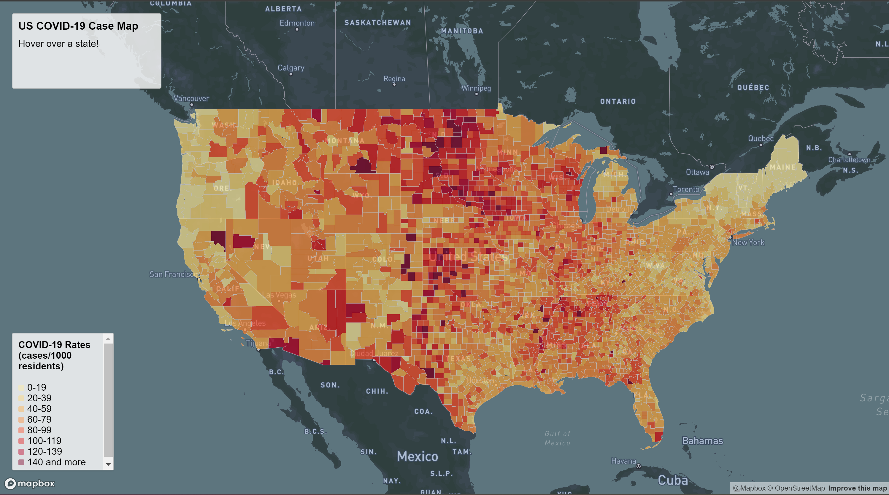
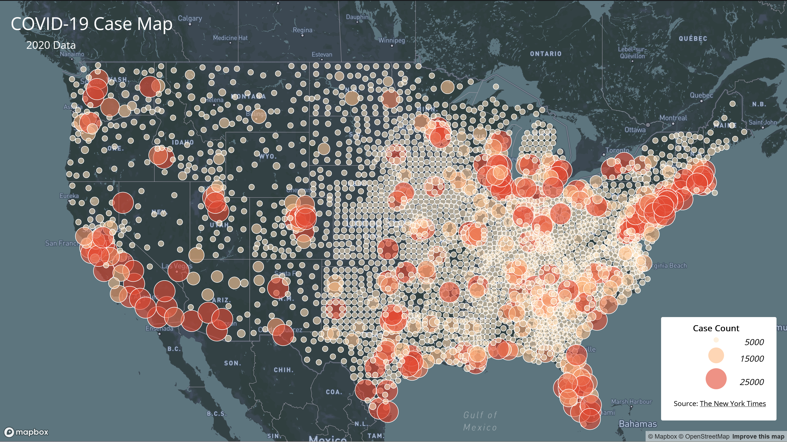

# COVID-19 Case/Rate Data Visualization

This project maps available COVID-19 information (2020 data) over the Contiguous United States at the county level to showcase how the diseases spread and the largest hotspots. In these interactive maps, COVID-19 Case (quantity) and Rate (cases per 1,000 people) data are visualized in two different mapping techniques.

### Map 1: COVID-19 Rate Map (Choropleth)

The first map is a Choropleth visualization of COVID-19 Rates measured in counts per 1,000 people. The data is broken up into 8 ranges, and each one is colored to signify how high of a rate exists in a given county.

[Click here to view the COVID-19 Rate Map](https://masonhowes.github.io/covid_case_visualization/map1.html).

### Map 2: COVID-19 Case Map (Proportional Symbol)

---

[Click here to view the COVID-19 Case Map](https://masonhowes.github.io/covid_case_visualization/map2.html).

